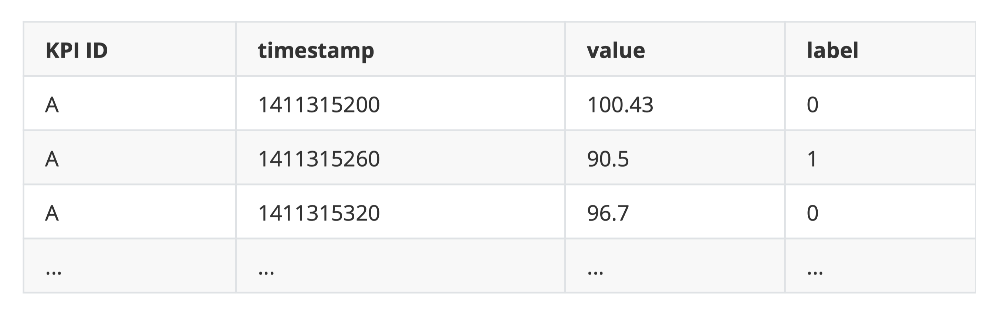

# anomaly_detection
基于LSTM的异常检测

## Introduction(简介)
这是AIOps的一个[异常检测竞赛项目](http://iops.ai)。

### Datasets(数据集)
数据集是从5个互联网公司收集的26个KPIs，分为有标记的训练集(data/train.csv)和无标记的测试集(data/test.csv)。

几个KPI的示意图

### Evaluation Metric(评估算法)
如果在规定时间内检测出异常点，则这整个区间都算作被你检测出来。否则，这个区间都算作没被检测出来。最后是在测试集上的f_score进行评测。

|Name|Description|
|:-:|:-:|
|preprocessing.py|使用线性插值填充missing points|
|lstm_train.py|基于LSTM的预测算法(训练)|
|predict.py|基于模型进行预测|

## Dependencies(环境依赖)
|Name|Version|
|:-:|:-:|
|python|3.6.6|
|tensorflow|>=1.10.0|
|keras|>=2.2.2|

## Model(模型)
采用的模型很简单，使用的是双层LSTM(没有尝试三层，因为训练时间直接double...)。
输入是当前时间点的前120(2小时)个点所构成的sliding window, 输出是next sliding window(即向后滑动一步)，也可以输出当前时间点。
即120 -> 120 或 120 -> 1。

|Parameter|Name|
|:-:|:-:|
|batch size|128|
|dropout|0.2|
|optimizer|Adam|
|classifier|Softmax|

评估是针对验证集上的f_score进行评估。将有异常的数据平均分为2份，保证验证集上也有一定数量的异常点。
而对于一些异常点非常少的KPI，在实验过程中发现，其验证集上的f_score始终为0。
于是我们重写loss函数，针对其FN(漏报)的部分进行惩罚(penalty)。如果在验证集上，FN很多，则相应的loss也会很大。
这样可以迫使模型尽可能的检测出异常点。

## Result(结果)
最后取得的f_score是0.746，相比于第一名少了0.02。

有几个部分是可以改进的(第一名的小组采用的方法)
1. post-processing: 输出的结果可以针对Evaluation Metric进行优化，比如一连串anomalies，只选择几个点，从而可以降低FP(误报率)。
2. over sampling: 简单的重复anomaly的部分，使得异常点和正常点达到1:1的比例。(本来是打算采用这个方法的，好像在看到哪里看到说这种方法不太好...后来就采用FN penalty的方法了)
